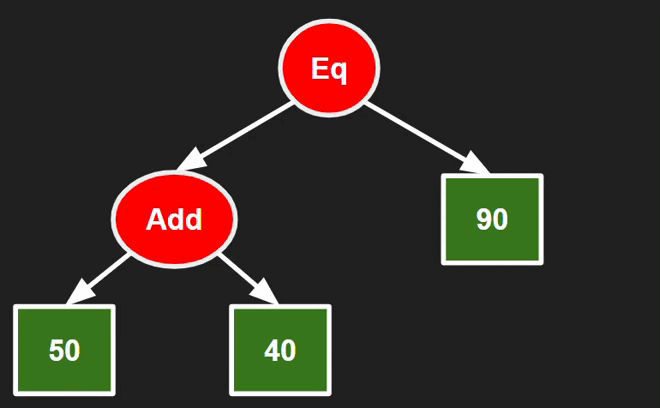

# luprcode
A code interpreter based on Binary Trees using Rust.

## How it works

<p align="center">
  
</p>

<p align="center"><em>Reducing the root recursively interprets the code.</em></p>

The `reduce` function is recursive and works as follows:

1. Calls `reduce` on its children.
2. Processes any command and updates the node's value with the result.
3. Removes the children, turning the node into a leaf.

## Build and run
```bash
git clone --depth=1 https://github.com/CoininDev/luprcode
cd luprcode
cargo run
```

## Commands
- Mathematical operations: Add!(), Sub!(), Mul!(), Div!(), Eq!()
- Boolean operations: Not!(), And!(), Or!(), Xand!(), Xor!()
- IfCmd!(): left node is the condition, and the right one is the action
- SetVar!(): left: ID, right: Value
- GetVar!(): left: ID.
- Destructor!(): removes itself and all the children
